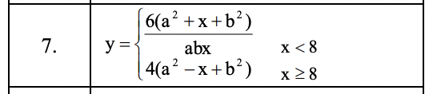

# Python_3_cross_DEMO_3

### Разработка кроссплатформенных приложений. Задание 3

#### Списки, кортежи, множества, диапазоны, словари, массивы

Имеется двухмерный массив 4x5 в виде списка в списке. Сделать консольную программу, которая
осуществляет заданный вариантом алгоритм обработки данных.

7. Если после максимального элемента таблицы расположена хотя бы одна единица, то увеличить все
положительные элементы таблицы в два раза

