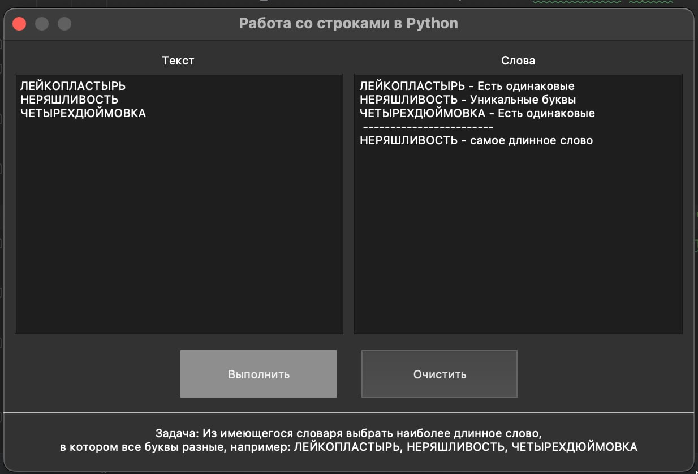

# Python_Z4_PyQt5_String
Работа с визуальными тестовыми данными в Python 3 с PyQt5

Задача: Из имеющегося словаря выбрать наиболее длинное слово, в котором все буквы разные, например:
ЛЕЙКОПЛАСТЫРЬ, НЕРЯШЛИВОСТЬ, ЧЕТЫРЕХДЮЙМОВКА

