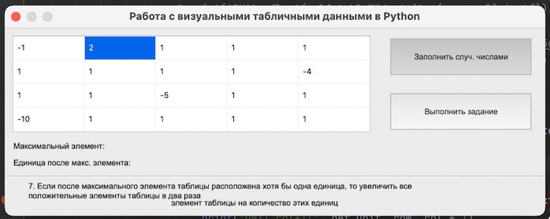
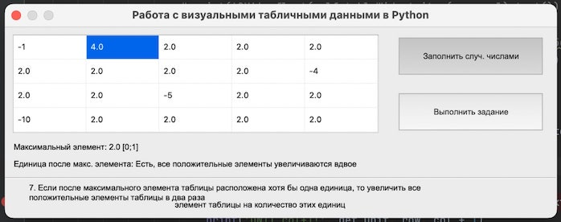

# Python_Z4_1_PyQt5_Table
Работа с визуальными табличными данными в Python 3 с PyQt5

Имеется двухмерный массив 4x5 в виде компонента «QTableWidget» , кнопка «QPushButton» с надписью
«Выполнить задание», кнопка «QPushButton» с надписью «Заполнить случайными числами» и компонент
«QLabel» для отображения текста варианта задания. Кнопка «Заполнить случайными числами» заполняет массив
случайными значениями от -0 до 100. Кнопка «Выполнить задание» выполняет обработку таблицы «QTableWidget»
по заданному в варианте алгоритму

7. Если после максимального элемента таблицы расположена хотя бы одна единица, то увеличить все
положительные элементы таблицы в два раза

