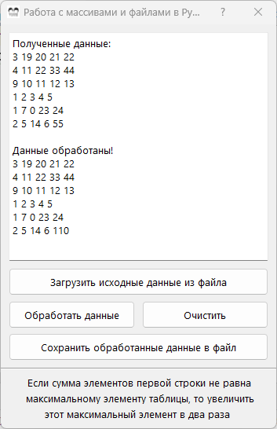

# Python_PyQt5_Z5
**Работа с массивами и файлами в Python**

Имеется двухмерный массив 5x6 целых чисел, загружаемый из файла. Неоходимо создать программу,
реализующую указанное в варианте задание. Программа должна:
1) считать из входного файла «input.txt» данные (значения массива) и вывести их на экран – кнопка
  «Загрузить исходные данные из файла»;
2) выполнить задание варианта: получить измененный массив (выходные данные) – кнопка «Обработать
данные»;
3) вывести выходные данные (содержимое измененного массива) на экран и сохранить их в выходной файл
«output.txt» - кнопка «Сохранить обработанные данные в файл».

Поменять местами максимальные элементы первой и второй строк таблицы, если сумма элементов больше 100, а третью строку заменить единицами

