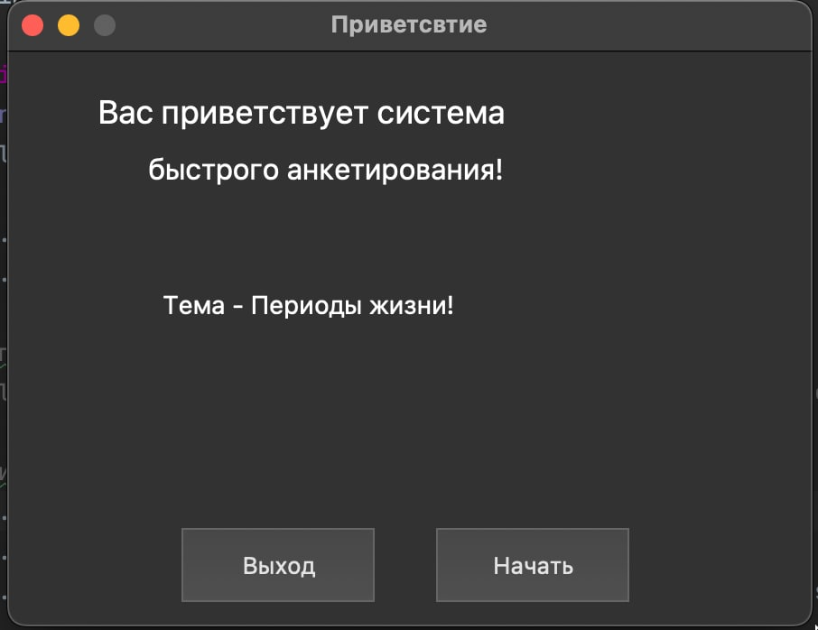

# Python_3_PyQt5_MultiForms_DEMO
Многооконная программа с компонентами выбора и списками в Python3 с PyQt5

[7] QCheckBox -> QRadioButton -> QTableWidget -> QLineEdit

1. Создать программу из пяти окон, с возможностью последовательного перехода из одного окна в другое -
вперед и назад. Данная программа должна выдавать справочную информацию об авторе в виде вопросов и
ответов. Каждое окно программы должно быть посвящено определенному жизненному этапу.
2. Название и тематика окон следующая:
 «Приветствие» (окно 1) – окно с краткой анкетной информацией об авторе программы;
 «Мое детство» (окно 2) – окно с вопросами и ответами про детство (до 7 лет);
 «Мое отрочество» (окно 3) – окно с вопросами и ответами про отрочество (от 7 до 16 лет);
 «Моя юность» (окно 4) – окно с вопросами и ответами про юность (от 16 до 23 лет);
 «Спасибо !» (окно 5) – окно с перечнем последних вопросов, которые пользователь задал в каждом
из окон 2, 3, 4.
3. Каждое из окон 2, 3 и 4 должно содержать тот компонент для выбора вопросов, который указан в варианте.
Ответ на выбранный вопрос должен отображаться в том же окне в компоненте «QLineEdit», в компоненте
«QTextEdit» или в компоненте «QLabel».
4. В пятом окне программа должна отобразить в указанном компоненте последний выбранный вопрос в каждой
из форм 2, 3 и 4.

